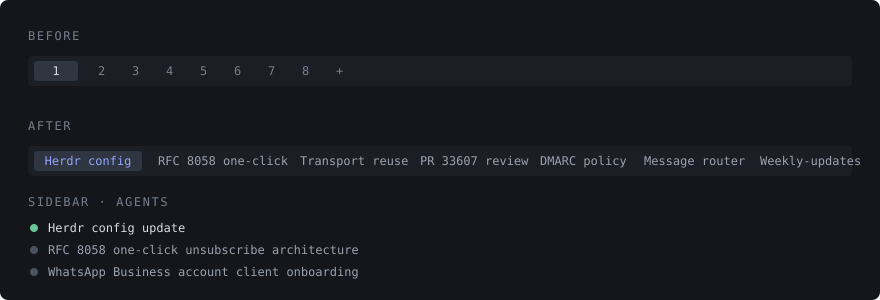

# Agent Tab Titles

A [Herdr](https://herdr.dev) plugin that renames each tab to the task its coding agent is working on.

Herdr tabs are numbered `1 2 3 4`, and naming them by hand is friction nobody keeps up with. Coding agents already publish what they are doing as the terminal title, so this plugin copies that onto the tab.



## Install

```sh
herdr plugin install ajaykumarMohite/herdr-agent-tab-titles --yes
herdr plugin action invoke ajaykumarmohite.agent-tab-titles.install-claude-code-hook
```

The second command registers a small shim on Claude Code's `UserPromptSubmit` and `Stop` events, so every tab relabels itself as work moves. Restart running Claude Code sessions afterwards — hooks load at session start.

Keep more than one Claude Code configuration? The action hooks `~/.claude` and every `~/.claude-*` directory it finds, so a split work/personal setup is covered in one run. Environment variables do not reach a plugin action — it runs under the Herdr server — so to target one directory elsewhere, call the script directly:

```sh
herdr plugin list                                  # prints the plugin's directory
python3 <plugin-dir>/install_claude_code_hook.py --config-dir ~/somewhere/.claude
```

## Use it without Claude Code

Every agent Herdr detects reports a terminal title, so the rename works for any of them. Two routes:

**The declared events.** The plugin listens for `pane.agent_status_changed` and `pane.agent_detected`, which Herdr dispatches to an installed plugin. No hook and no configuration.

**On demand.** Sweep every pane yourself:

```sh
herdr plugin action invoke ajaykumarmohite.agent-tab-titles.rename-all
```

Bind that to a key in `~/.config/herdr/config.toml`:

```toml
[[keys.command]]
key = "prefix+alt+t"
type = "shell"
command = "herdr plugin action invoke ajaykumarmohite.agent-tab-titles.rename-all"
```

## Actions

| Action | What it does |
|---|---|
| `rename-all` | Relabels every tab from the title its agent reports right now. Safe to run repeatedly. |
| `install-claude-code-hook` | Writes `hooks/herdr-agent-tab-title.sh` into `~/.claude` and every `~/.claude-*` directory, and registers it on `UserPromptSubmit` and `Stop`. Rerunning is idempotent. |

## What it does

`rename_tabs_from_agent_titles.py` reads a pane's `terminal_title_stripped` through the Herdr CLI and renames that pane's tab to it, shortened to 18 characters on a word boundary. It skips the rename when the label already matches, so it is cheap to run on every prompt.

Titles that are not tasks are ignored, so a tab keeps its last real label instead of flickering:

- shell titles — anything containing `@`, or starting with `/` or `~`
- bare product names — `claude`, `codex`, `copilot`, `cursor`, `droid`, `gemini`, `opencode`, `qwen`

The script takes `--all` to sweep every pane, `--pane <id>` to do one, or nothing at all, in which case it reads the pane out of `HERDR_PLUGIN_EVENT_JSON`. That is the whole interface — the entire Herdr CLI is the plugin API, so there is no daemon and no state to keep.

## Suggested sidebar

Not required, but the titles read better with one line per agent:

```toml
[ui]
prompt_new_tab_name = false

[ui.sidebar.spaces]
rows = [["state_icon", "workspace", "git_status"]]

[ui.sidebar.agents]
rows = [["state_icon", "terminal_title_stripped"]]
```

`prompt_new_tab_name = false` drops the "name this tab" dialog on every new tab — the point of the plugin is that you never name one again. Apply with `herdr server reload-config`, which returns `"diagnostics":[],"status":"applied"` on a clean load and names the offending key otherwise.

`terminal_title_stripped` is valid only in `[ui.sidebar.agents]`. The spaces panel accepts `state_icon`, `state_text`, `workspace`, `branch`, `git_status` and `$custom` tokens, and rejects anything else with `unknown sidebar token; custom tokens must start with $`.

## Troubleshooting

**A tab still shows a number.** Its agent session started before the hook was installed, or it has no real task yet. Restart that session, or run `rename-all`.

**Nothing renames at all.** Check the plugin is enabled, then read what its commands did — each entry carries the event or action id, exit code, and stderr:

```sh
herdr plugin list
herdr plugin log list --plugin ajaykumarmohite.agent-tab-titles
```

**Events never appear in that log.** They are dispatched to an *installed* plugin. A plugin linked from a local directory with `herdr plugin link` did not receive them in testing, so check against an installed copy before concluding the events are dead.

**A tab took the wrong name.** Split panes share one tab, so two agents in one tab compete and the last to report wins. Give them separate tabs.

## Development

```sh
git clone https://github.com/ajaykumarMohite/herdr-agent-tab-titles
herdr plugin link ./herdr-agent-tab-titles

python3 -m unittest discover -s tests -p "*_test.py"   # pure logic, no Herdr needed
sh tests/smoke.sh                                      # real rename; skips outside Herdr
```

CI runs both on every push. Remember that a linked plugin does not receive events — install from a branch to exercise that path.

## Requirements

Herdr 0.9.0 or newer, `python3` on `PATH`, Linux or macOS.

## Uninstall

```sh
herdr plugin uninstall ajaykumarmohite.agent-tab-titles
```

Then remove the two `herdr-agent-tab-title.sh` entries from `~/.claude/settings.json` and delete `~/.claude/hooks/herdr-agent-tab-title.sh`. Tab names stay as they are; `herdr tab rename <tab-id> <name>` resets one.

## Licence

MIT — see [LICENSE](LICENSE).
